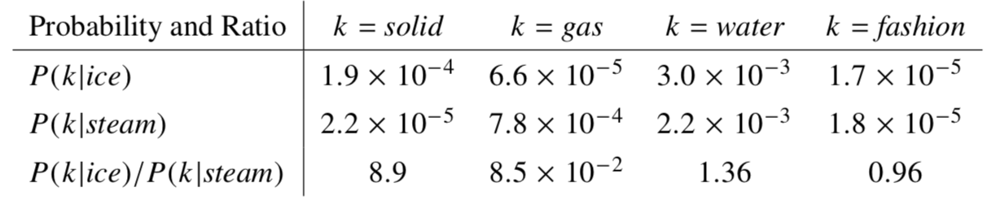

## GloVe by PyTorch

### Chen Mingyang / Oct. 16 2018

#### Basics 

+ In this GloVe model, there are some notation,

  | Notation | Explanation                                                  |
  | -------- | ------------------------------------------------------------ |
  | $X$      | matrix of word-word co-occurrence counts                     |
  | $X_{ij}$ | the number of times word $j$ occurs in the context of word   |
  | $X_i$    | $=\sum_{k}X_{ik}$, the number of times any word appears in the context of word i |
  | $P_{ij}$ | $ = P(i|j) = X_{ij} / X_i$, the probability that word j appear in the context of word i |

+ For words $k$ related to $ice$ but not $steam$, say $k = solid$, we expect the ratio $P_{ik}/P_{jk}$ will be large and vice versa. The following table confirms the expectations.

  

  So appropriate starting point for word vector learning should be with **ratios of co-occurrence probabilities** rather than the probabilities themselves.

+ The general model takes the form, where $w$ is the word vector and $\tilde{w}$ is the context word vector 
  $$
  F(w_i, w_j, \tilde{{w}_k}) = \frac{P_{ik}}{P_{jk}} \tag{1}
  $$
  Since vector spaces are inherently **linear structures**, then modifying Eqn. (1) to   
  $$
  F(w_i - w_j, \tilde{{w}_k}) = \frac{P_{ik}}{P_{jk}} \tag{2}
  $$
  For not to obfuscate the **linear structure** we are trying to capture, the take the dot product, 
  $$
  F((w_i - w_j)^{T}\tilde{{w}_k}) = \frac{P_{ik}}{P_{jk}} \tag{3}
  $$
  We want $F$ be **homomorphism**, so 
  $$
  F((w_i - w_j)^{T}\tilde{{w}_k}) = \frac{F(w_i^{T} \tilde{{w}_k})} {F(w_j^{T} \tilde{{w}_k})} \tag{4}
  $$
  From Eqn.3 
  $$
  {F(w_i^{T} \tilde{{w}_k})} = P_{ik} = \frac{X_{ik}}{X_i} \tag{5}
  $$
  The solution for Eqn. (4) is $F = \mathrm{exp}​$, or 
  $$
  w_i^{T} \tilde{{w}_k} = log(X_{ik})-log({X_i}) \tag{6}
  $$
  The term $log(X_i)$ is **independent** of $k$ and be absorbed into bias $b_i$ for $wi$, for **symmetry**, we alos add a bias $\tilde{b}_k$, so we have
  $$
  w_i^{T} \tilde{{w}_k} + b_i+ \tilde{b}_k= log(X_{ik}) \tag{7}
  $$
  Naturally, the **cost function** is 
  $$
  J = \sum \limits_{i, j}^{V} f(x_{ij})(w_i^{T} \tilde{{w}_k} + b_i+ \tilde{b}_k - log(X_{ik}))^{2} \tag{8}
  $$
  where $V$ is the size of vocabulary and $f(x_{ij})$ is a **weighting funtion** 
  $$
  \begin{equation}
  f(x) = 
  \left\{
               \begin{array}{lr}
               (x / x_{max})^{\alpha} & if \ x < x_{max} \\
               1 & \mathrm{otherwise}\\
               \end{array}
  \right.
  \end{equation}\tag{9}
  $$
  


 #### Implementation

1. Dataset

   ```python
   class Dataset:
       """Do some managements of training data
       
       Attributes:
           filename:      filename of input training data
           word_num:      number of expected number of training words
           context_size:  considered size of context of one word  
           words:         all the words in training file
           count:         a list of [[word: count], ... ...], the length is word_num
           word_dict:     the dict of words with the order of count, {word: idx}
           rev_word_dict: reverse word_dict, {idx: word}
           data:          a list of idx corresponding to words 
           commat:        co-occurrence matrix 
           comat_nz:      none-zero position in commat
       """
   
       def __init__(self, filename='./text8.zip', word_num=100, context_size=3):
           """Init Dataset class with input file and expected word_num, context_size
           
           Args:
               filename:     filename of input training data
               word_num:     number of expected number of training words
               context_size: considered size of context of one word  
           """
           
       def read_file(self):
           """Read file by filename into words"""
               
       def build_dataset(self):
           """Build the dataset and get count, word_dict and rev_word_dict"""
       
       def build_comat(self):
           """Build co-occurrence matrix"""
          
       def gen_batch(self, batch):
           """Generate batch for batch learning"""
   ```

2. GloVe

   ```python
   class GloVe:
       """Main part of GloVe model for training 
   
       Attributes:
           filename:     filename of input training data
           word_num:     number of expected number of training words
           context_size: considered size of context of one word  
           batch:        number of training samples in one batch
           x_max:        threshold for weight function
           alpha:        parameter for weight function 
           embed_dim:    size of each embedding vector
           epoch:        number of iteration 
           lr:           learning rate
           outfile:      filename of output trained glove embedding 
           dictfile:     filename of word dict for storing word dict
       """
   
       def __init__(self, filename='./text8.zip', word_num=100, context_size=3, batch=8,
                    x_max=3, alpha=0.75, embed_dim=10, epoch=10, lr=0.001,
                    outfile='./GloVe', dictfile='./word_dict'):
           """Init this GloVe model"""
       
       def f(self, xx):
           """Implementation of weright funtion"""
   
       def forward(self, x, y):
           """Process of fowarding from imput word pair to cost function J in batch form"""
           
       def train(self):
           """Start training the model and embedding"""
   ```

#### Train and Test

1. Train GloVe 

   ```bash
   python ./train.py
   ```

   You can set hyper paramters in the main of train.py. The default output embedding is './GloVe', and default dictionary is './word_dict'

2. Test trained model

   The embedding model file and word dictinary file can be transformed as argvs, 

   ```bash
   python ./test.py word_dict GloVe
   ```

   and "glove" and "word_dict" are default argvs. 

   ```bash
   python ./test.py
   ```

3. Pre-trained embedding

   File 'GloVe_1k_11h' and 'word_dict_1k_11h' is the pre-trained embedding and word dictionary of 1k words from text8. Try to test it.

   ```Bash
   python ./test.py word_dict_1k_11h GloVe_1k_11h
   ```

#### References

+ GloVe: Global Vectors for Word Representation https://nlp.stanford.edu/projects/glove/
+ GloVe:另一种Word Embedding方法 http://www.pengfoo.com/post/machine-learning/2017-04-11

+ Glove http://vsooda.github.io/2016/04/06/Glove/

  


