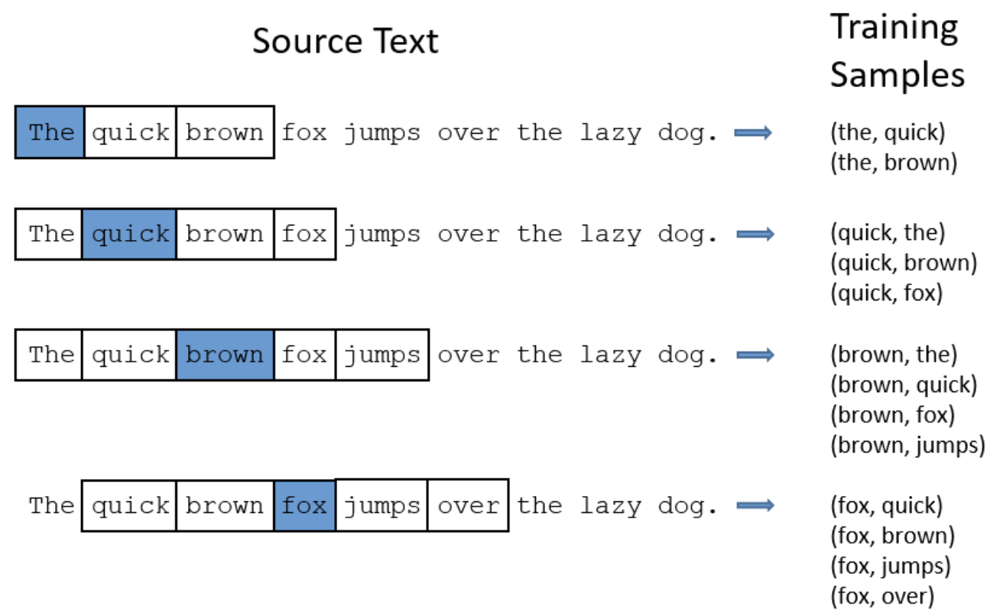
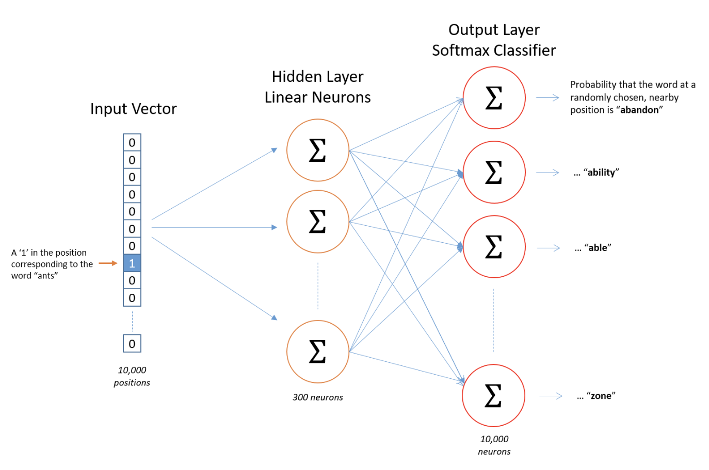

## Skip-gram with Negative Sampling by PyTorch

### Chen Mingyang / Oct. 8 2018

#### Basics

+ The size of skip window

  

+ The architecture of neural network for Word2Vec

  

+ The training sets are word pairs, the training input and output are words encoded by one-hot vectors. But when you evaluate the trained network on an input word, the output vector will actually be a **probability distribution**.

+ The hidden layer of this model is really just operating as a **lookup table**.

+ Each output neuron has a weight vector which it multiplies against the word vector from the hidden layer.

+ If two words have similar contexts, then our network is motivated to learn similar word vectors for these two words.

+ With negative sampling, we are instead going to randomly select just a small number of “negative” words to update the weights for (a “negative” word is one for which we want the network to output a 0 for).

+ The target is $ log\sigma(v_c⋅v_w) + \sum_{w_j \in W_{negative}} log \sigma (−v_{wj}⋅v_c) $, where $(v_c, v_w)$ is the word pair.

#### Implementation

1. Dataset

   ```python
   class Dataset:
       """Do some management of training data
       
       Attributes:
           words:         all the words in training file
           count:         a list of [[word: count], ... ...], the length is word_num
           word_dict:     the dict of words with the order of count, {word: idx}
           rev_word_dict: reverse word_dict, {idx: word}
           data:          a list of idx corresponding to words 
           sample_data:   sampleing table for nagative sampling
           skip_index:    index of the first data of one skip in one generation
       """
       
       def __init__(self, filename, word_num):
           """Init Dataset class with input file and expected word_num
           
           Args:
               filename: filename of input training data
               word_num: number of expected number of training words
           """
       
       def build_dataset(self):
           """Build the dataset and get words, coutn, word_dict and rev_word_dict"""
           
       def gen_batch(self, batch_size, skip_window, num_skips):
           """Generate one batch for batch training
           
           Args:
               batch_size:  size of one batch
               skip_window: length of one skip window on one side of target [skip_windos, target ,skip_window]
               num_skips:   number of selected context word in one skip
               
           Returns:
               x, y: np.array of x and y in this batch
           """
       
       def build_sample_table(self):
           """Build the sampling table for negative sampling"""
           
       def get_neg_sample(self, x_len, neg_cnt):
           """Get negatiee samples of current batch
           
           Args: 
               x_len:   length of x in this batch, actually the batch size
               neg_cnt: number of negative samples for one x
               
           Returns:
               neg: negative samples selected by random for this batch
           """
   ```

   

2. SkipGram

   ```python
   class SkipGram(nn.Module):
       """Class of skip gram model 
       
       Attributes:
           embed_num:   size of the dictionary of embeddings
           embed_dim:   the size of each embedding vector
           embed:       weight of networks for input to hidden
           embed_prime: weight of networks for hidden to output
       """
       
       def __init__(self, embed_num, embed_dim):
           """Init skip gram model
           
           Args:
               embed_num:   size of the dictionary of embeddings
               embed_dim:   the size of each embedding vector
           """
           
       def forward(self, x, y, neg):
           """Forward of this netword
           
           Args: 
               x:   training x
               y:   training y
               neg: negative sample 
           
           Returns:
               Optimization target function
           """
   ```

3. Word2Vec

   ```python
   class Word2Vec():
       """Main class for word2vec model
       
       Attributes:
           filename:    filename of input training data
           word_num:    number of expected number of training words
           batch_size:  number of training samples in one batch
           skip_window: length of one skip window on one side of target [skip_windos, target ,skip_window]
           num_skips:   number of selected context word in one skip
           embed_dim:   size of each embedding vector
           epoch:       number of iteration 
           lr:          learning rate
           neg_cnt:     number of negative samples for one x
           outfile:     filename of output trained skip gram model
           dicfile:     filename of word dict for storing word dict
       """
   
       def __init__(self, filename='./text8.zip', word_num=200, 
                    batch_size=8, skip_window=2, num_skips=2,
                    embed_dim=10,
                    epoch=100, lr=0.025, 
                    neg_cnt=5,
                    outfile='./skip_gram', dictfile='./word_dict'):
           """Init this word2vec model"""
           
       def train(self):
           """Start train the model and embedding"""
   ```

#### Train and Test

1. Train Word2Vec 

   ```Bash
   python ./train.py
   ```

   You can set hyper paramters in the main of train.py

2. Test trained model

   The embedding model file and word dictinary file can be transformed as argvs, 

   ```Bash
   python ./test.py word_dict skip_gram
   ```

   and "skip_gram" and "word_dict" are default argvs. 

   ```bash
   python ./test.py
   ```

#### References

+ Word2Vec Resources http://mccormickml.com/2016/04/27/word2vec-resources/

+ Word2Vec原理之负采样算法 http://qiancy.com/2016/08/24/word2vec-negative-sampling/

+ Word2vec with Pytorch https://adoni.github.io/2017/11/08/word2vec-pytorch/

  